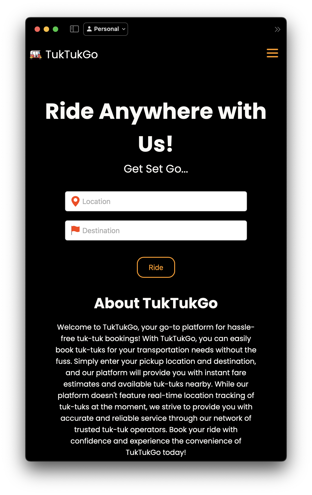
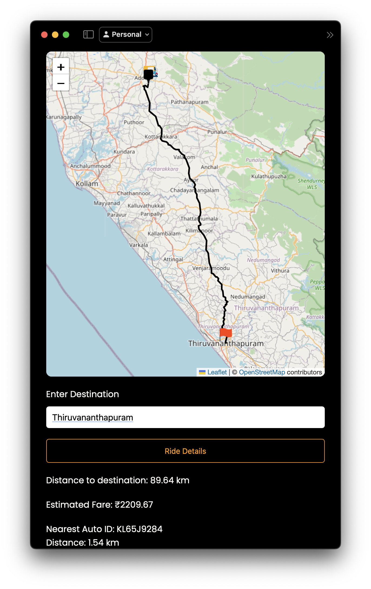

# 🚗 TukTukGo - Mini Project

  

Welcome to the **Auto Booking Site**, a mini-project designed to revolutionize the way you book vehicles online. Whether you're planning a road trip or need a vehicle for daily commuting, our platform offers a seamless experience to find and reserve the perfect vehicle.

## 🌟 Key Features

- **📱 Responsive Design:** Enjoy a smooth experience on both desktop and mobile devices.
- **👤 User Profiles:** Manage your bookings, view history, and update your personal details effortlessly.
- **🛠️ Admin Dashboard:** Manage vehicle listings, track bookings, and respond to user inquiries with ease.




## 🚀 Getting Started

Follow these instructions to set up the project on your local machine.

### Prerequisites

Ensure you have the following installed:

- [Django](https://www.djangoproject.com) 
- [MySQL](https://www.mysql.com)
- [Git](https://git-scm.com/)

### Installation

1. **Clone the Repository:**
   ```bash
   git clone https://github.com/Aathi-pr/Mini-project.git
   ```
   
2. **Navigate to the Project Directory:**
 ```bash
   cd Mini-project
```

3. **Create virtual env:**
```bash
pip3 install pipenv
```

4. **Installing Django:**
```bash
pipenv install django
```
**Process updating soon...**


